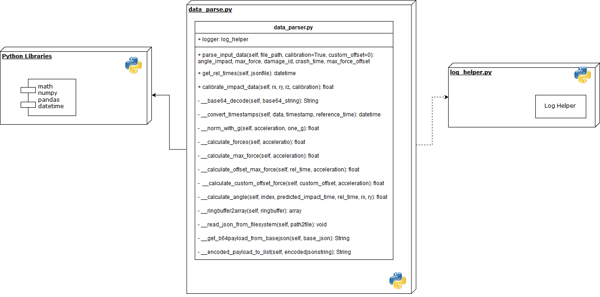

# Data Parser / Data Processing


## Funktionsumfgang

Mit der Klasse Data_Parser werden alle Funktionalitäten im Zusammenhang mit der Datenverarbeitung, AUswertung und Konvertierung erledigt.
Das beinhaltet das einlesen der JSON Daten, ausfiltern der relevanten Key:Value Paare, transformieren der relativen Werte sowie die mathematischen Umrechnungen auf die geforderten Output Daten (Kraft & Winkel des Einschlags)

### Software Abhängigkeiten

Zum auslesen der JSON Daten wurde die Python Library `json` verwendet. Zur Decodierung und Encodierung wurde das base64 Format verwendet.
Für die Mathematischen umrechnungen wurden die Libraries `math`, `pandas` sowie `numpy` verwendet.

Für die Umrechnung der relativen Zeiten konnte auf die Standard Library `datetime zurückgegeriffen werden.

Um während dem Testing ein sauberes Logging zu erhalten, wurde auch hier unsere gemeinsame Log Klasse `log_helper` eingebunden.

### Prozess des Funktiondesigns

Zu Beginn werden die JSON Input Daten eingelesen und der Payload extrahiert. dieser wird mit base64 decodiert und danach die relevanten Key:Value Paare (Beuschlunigung x,y,z) ausgelesen.
Diese Daten werden danach mit einer vordefinierten Kalibration transformiert und mit einem Referenz-G Wert in G-Kräfte umgewandelt.
Zum Schluss erfolgt die Umwandlung der Kräfte in einen Winkel, relativ zur virtuellen Bildmitte.
Zeit, Kraft und Winkel werden danach zur Visualisierung an die Klasse `Damage_drawer` übergeben.

## Realisation / Umsetzung

Klassendiagramm und Beschreibung der Funktionen der einzelnen Methoden.

## Klasse DamageImage

Teilfunktion: Damage Image



### Methode: parse_input_data

```python
def parse_input_data(self, file_path, calibration=True, custom_offset=0):
```

| Paramenter         | Beschreibung
|--------------------|-------------------------------------------------------------------------------------------------------------|
| `self`             | Instanz-Referenz                                                                                            |
| `file_path`        | Das Input JSON File, entweder als Pfad zum Filesystem oder direkt als Objekt                                |
| `calibration`      | Angabe ob die Werte mit oder ohne Kalibration berechnet werden sollen                                       |
| `custom_offset`    | Spezifische Offsettime (im Range 0 - 16000). Ohne Angabe wir der Offset mit der grössten G-Kraft verwendet |


Die Methode `parse_input_data` wird von extern verwendet und führt alle Teilfunktionen zusammen. Das JSON File wird entweder als Objekt oder als Filepath übergeben und danach verarbeitet. Zusätzlich besteht die Möglichkeit die Berechnungen ohne Kalibration auszuführen (nur für Testzwecke nützlich). Ausserdem kann via `custom_offset` ein beliebiger Offset in Millisekunden angegeben werden, standardmässig werd der Zeitpunkt der grössten Krafteinwirkung selbst berechnet.

Als Rückgabeparameter liefert die Methode:


| Return             | Beschreibung
|--------------------|-------------------------------------------------------------------------------------------------------------|
| `angle_impact`     | Einschlagswinkel                                                                                            |
| `max_force`        | Die maximale G-Kraft                                                                                        |
| `damage_id`        | Die Crash ID aus dem JSOn File                                                                              |
| `crash_time`       | Die Genaue Zeit des Einschlags mit Maximaler Kraft                                                          |
| `max_force_offset` | Den Offset zum Beginn des EInschlags bis Maximal Kraft erreicht wurde                                       |


### Methode: get_rel_times

```python
def get_rel_times(self, jsonfile):
```

| Paramenter         | Beschreibung
|--------------------|------------------------------------------------------------------------------------------------------------|
| `self`             | Instanz-Referenz                                                                                           |
| `jsonfile`         | Das Input JSON File                                                                                        |


Die Methode `get_rel_times` wandelt die Relativen Zeiten Anhand des Referenzwertes zu realen Zeiten um. Diese Information wird benötigt um den genauen Zeitpunkt zurückzugeben, an dem am meisten Kräfte auf das Auto wirkten.

### Methode: __base64_decode

```python
def __base64_decode(self, base64_string):
```

| Paramenter         | Beschreibung
|--------------------|------------------------------------------------------------------------------------------------------------|
| `self`             | Instanz-Referenz                                                                                           |
| `base64_string`    | Base64 Payload als String                                                                                  |


Die Methode `__base64_decode` wandelt einen base64 Payload in einen UTF-8 json Paylod um.

### Methode: __convert_timestamps

```python
def __convert_timestamps(self, data, timestamp, reference_time):
```

| Paramenter         | Beschreibung
|--------------------|------------------------------------------------------------------------------------------------------------|
| `self`             | Instanz-Referenz                                                                                           |
| `data`             | Data Payload (JSON)                                                                                        |
| `timestamp`        | Den Timestamp aus dem Input JSON                                                                           |
| `reference_time`   | Die Referenzzeit aus dem Input JSON                                                                        |


Die Methode `__convert_timestamps` wandelt die relativen Zeiten der einzelnen Beschleunigungsmessungen in reale Zeiten um.

### Methode: calibrate_impact_data

```python
def calibrate_impact_data(self, rx, ry, rz, calibration):
```

| Paramenter         | Beschreibung
|--------------------|------------------------------------------------------------------------------------------------------------|
| `self`             | Instanz-Referenz                                                                                           |
| `rx`               | Array der X-Achsen Beschleunigungen                                                                        |
| `ry`               | Array der Y-Achsen Beschleunigungen                                                                        |
| `rz`               | Array der Z-Achsen Beschleunigungen                                                                        |
| `calibration`      | Referenz Kalibration von Autosense                                                                         |

Die Methode `calibrate_impact_data` wandelt die Arrays der x,y und z Beschleunigungen mit der von Autosense vorgegebenen Kalibration um, somit erhält man die Beschleunigungsvektoren relativ zur Auto Mitte.


### Methode: __norm_with_g

```python
def __norm_with_g(self, acceleration, one_g):
```

| Paramenter         | Beschreibung
|--------------------|------------------------------------------------------------------------------------------------------------|
| `self`             | Instanz-Referenz                                                                                           |
| `acceleration`     | Beschleunigungsvektor                                                                                      |
| `one_g`            | Referenz G Kraft                                                                                           |

Die Methode `__norm_with_g` berechnet anhand der vorgegebenen G-Kraft die normierte G-Kraft des Beschleunigungsvektors.

### Methode: __calculate_forces


```python
def __calculate_forces(self, acceleration):
```

| Paramenter         | Beschreibung
|--------------------|------------------------------------------------------------------------------------------------------------|
| `self`             | Instanz-Referenz                                                                                           |
| `acceleration`     | Beschleunigungsvektor                                                                                      |

Die Methode `__calculate_forces` berechnet mittels Wurzelrechnung die effektiven Kräfte.

### Methode: __calculate_max_force


```python
def __calculate_max_force(self, acceleration):
```

| Paramenter         | Beschreibung
|--------------------|------------------------------------------------------------------------------------------------------------|
| `self`             | Instanz-Referenz                                                                                           |
| `acceleration`     | Beschleunigungsvektor                                                                                      |

Die Methode `__calculate_max_force` berechnet, wann die grösste Kraft in der Messung auftrat und gibt diese Kraft zurück.


### Methode: __calculate_offset_max_force

```python
def __calculate_offset_max_force(self, rel_time, acceleration):
```

| Paramenter         | Beschreibung
|--------------------|------------------------------------------------------------------------------------------------------------|
| `self`             | Instanz-Referenz                                                                                           |
| `rel_time`         | Relative Zeit von Max-Force                                                                                |
| `acceleration`     | Beschleunigungsvektor                                                                                      |

Die Methode `__calculate_offset_max_force` berechnet, wann die grösste Kraft in der Messung auftrat und gibt den Zeitpunkt als Offset zurück.

### Methode: __calculate_custom_offset_force


```python
def __calculate_custom_offset_force(self, custom_offset, acceleration):
```

| Paramenter         | Beschreibung
|--------------------|------------------------------------------------------------------------------------------------------------|
| `self`             | Instanz-Referenz                                                                                           |
| `custom_offset`    | Relative Zeit, custom Offset                                                                               |
| `acceleration`     | Beschleunigungsvektor                                                                                      |

Die Methode `__calculate_custom_offset_force` berechnet, wann die Kraft zu einem beliebigen Offset in der Messung und gibt diese Kraft zurück.

### Methode: __calculate_angle

```python
def __calculate_angle(self, index,
                      predicted_impact_time, rel_time, rx, ry):
```

| Paramenter              | Beschreibung
|-------------------------|------------------------------------------------------------------------------------------------------------|
| `self`                  | Instanz-Referenz                                                                                           |
| `index`                 | Index der Maximalen Kraft im rx und ry Array                                                               |
| `predicted_impact_time` | Die Berechnete Impact Zeit der Max-Force                                                                   |
| `rel_time`              | Die Relative Zeit des Einschlags                                                                           |
| `rx`                    | Array der X-Achsen Beschleunigungen                                                                        |
| `ry`                    | Array der Y-Achsen Beschleunigungen                                                                        |


Die Methode `__calculate_angle` berechnet mittels euklidischer Distanz den Einschlags-Winkel anhand der Kräfte Vektoren.

### Methode: __ringbuffer2array

```python
def __ringbuffer2array(self, ringbuffer):
```

| Paramenter         | Beschreibung
|--------------------|------------------------------------------------------------------------------------------------------------|
| `self`             | Instanz-Referenz                                                                                           |
| `ringbuffer`       | Input JSON Daten                                                                                           |

Da die Daten im JSON als Ringbuffer gespeichert werden, sortier die Methode `__ringbuffer2array` die Werte zuerst chronologisch.

### Methode: __read_json_from_filesystem

```python
def __read_json_from_filesystem(self, path2file):
```

| Paramenter         | Beschreibung
|--------------------|------------------------------------------------------------------------------------------------------------|
| `self`             | Instanz-Referenz                                                                                           |
| `path2file`        | Input JSON Daten als Pfad oder direkt als String                                                           |

Die Methode `__read_json_from_filesystem` liest die Input JSON Daten entweder vom Filesystem oder direkt aus einem String.

### Methode: __get_b64payload_from_basejson

```python
def __get_b64payload_from_basejson(self, base_json):
```

| Paramenter         | Beschreibung
|--------------------|------------------------------------------------------------------------------------------------------------|
| `self`             | Instanz-Referenz                                                                                           |
| `base_json`        | Input JSON Daten                                                                                           |

Die Methode `__get_b64payload_from_basejson` extrahiert den Base64 Payload aus dem Input JSON.


### Methode: __encoded_payload_to_list

```python
def __encoded_payload_to_list(self, encodedjsonstring):
```

| Paramenter          | Beschreibung
|---------------------|------------------------------------------------------------------------------------------------------------|
| `self`              | Instanz-Referenz                                                                                           |
| `encodedjsonstring` | Input JSON Daten als encodierter String.                                                                   |

Die Methode `__encoded_payload_to_list` konvertiert den encodierten JSON String in eine Python List zur besseren weiterverarbeitung.

## Implementierung im Projekt

Innerhalb von dem Projekt werden wir die Funktion `parse_input_data` wie folgt benutzt:

Die Json Daten werden an die Klasse "data_parse" übergeben, welche danach die Rückgabewerte Kraft, Winkel und Zeit liefert.
Diese Informationen werden einem drawer-Objekt übergeben, welches anhand dieser Parameter das EInschlagsbild zeichnet (siehe Kapitel 4.5 & 4.6)
