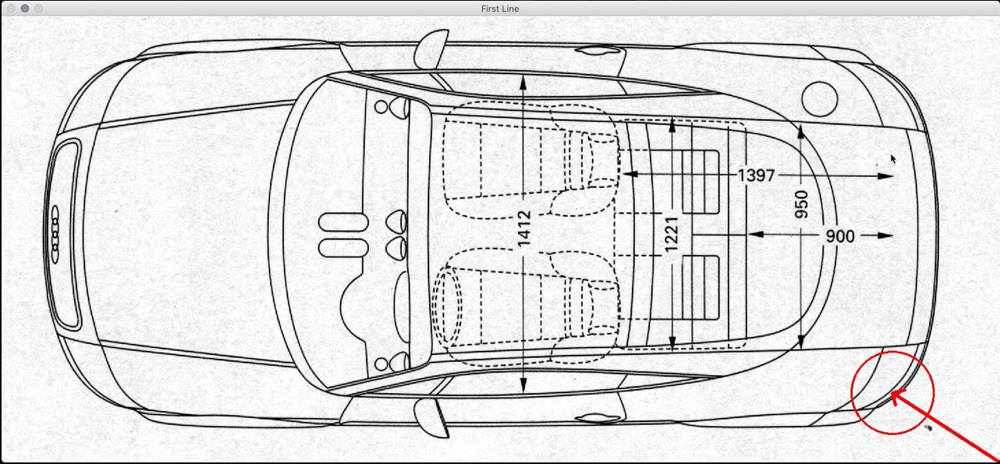
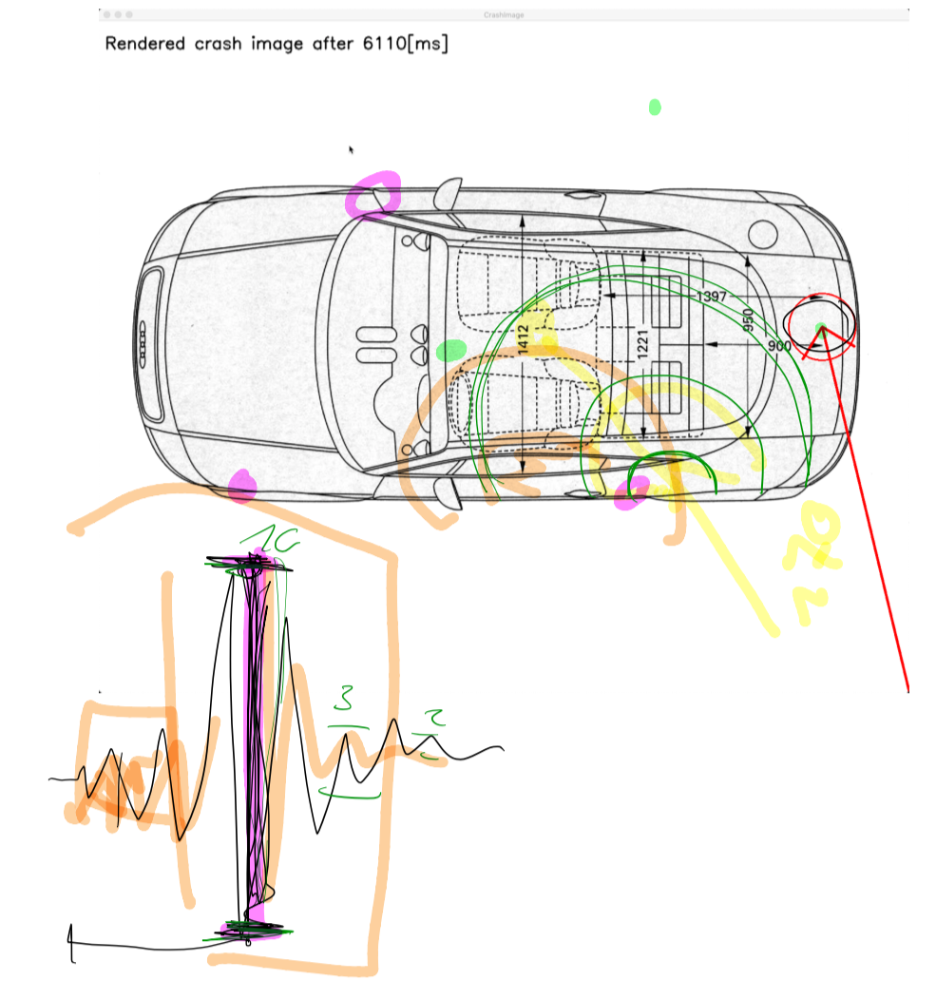
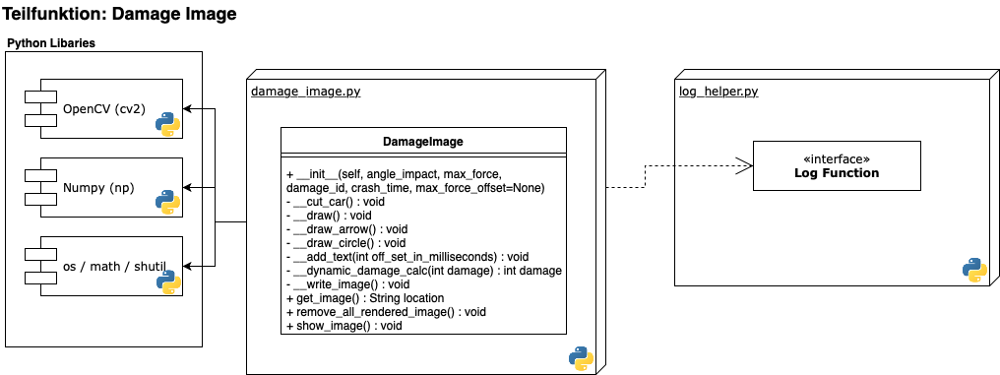
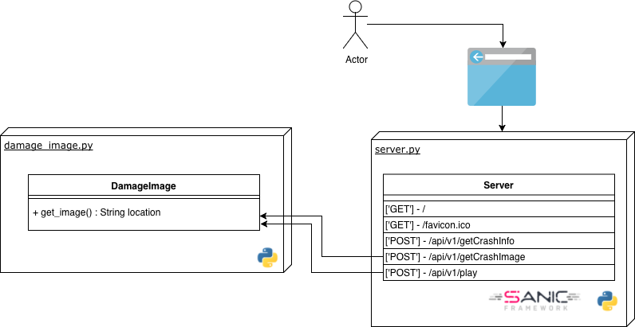
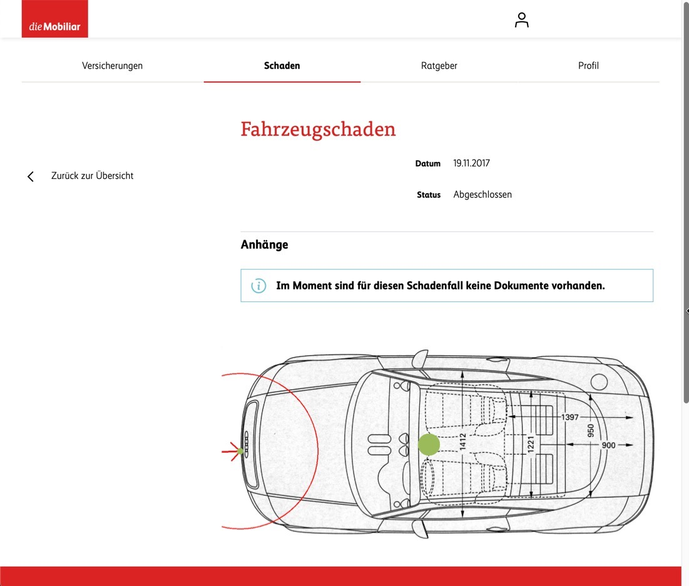

# Damage drawer

## Funktionsumfgang

Mit der Klasse DamageImage (File: `damage_image.py`) werden alle Funktionalitäten im Zusammenhang mit der Bild-Generierung gebündelt. Dies umfasst zum Beispiel das Erkennen der Konturen von dem Auto, das Zeichnen der Beschädigung wie auch das Beschriften der Millisekunden des Aufpralls, die Crash-ID und weitere Informationen.

## Funktiondesign

### Software Abhängigkeiten

Für die Erkennung der Konturen wird die Bildverarbeitungs Library OpenCV (Open Source Computer Vision Library) verwendet. Die Konturen werden verwendet um die Lokation der Beschädigung zu berechnen.

Für die Berechnung innerhalb der Klasse DamageImage wird auf die bekannte Python Library Numpy (http://www.numpy.org) zurückgegriffen.

Die Python Standardbibliotheken `os` / `math` / `shutil` werden für kleinere Funktionen benötigt.

### Prozess des Funktiondesigns

Zu Beginn wurde mittels OpenCV die Datei eingelesen und hardcoded ein Kreis und ein Pfeil gezeichnet. Mit dieser Version haben wir dann im Team das Zieldesign der Bilddatei mittels iPad und Pen gezeichnet.

|Erste Version Damage Image                                                         |
|:---------------------------------------------------------------------------------:|
|{ width=300px }  |

|Skizze Damage Image                                                 |
|:-------------------------------------------------------------------:|
|{ width=300px }|

## Klasse DamageImage

Teilfunktion: Damage Image

## Implementierung im Projekt

Innerhalb des Projekts wird die Funktion `get_image` wie folgt benutzt:

Innerhalb vom `server.py` wird ein Damage drawer Objekt erstellt und mittels der Funktion `get_image` die fertig gerenderte Bilddatei zurückgegeben und auf der Webseite dargestellt.

## Mögliche Darstellung der Datei in einem Portal

Ein möglicher Einsatzbereich von unserem Projekt könnte ein Portal einer Versicherung sein. Hier würde bei Autounfällen der Ort des Schadens wie auch das Ausmass der Beschädigung aufgezeigt werden. So kann ein Mehrwert in Form von mehr Informationen für den Kunden einer Autoversicherung entstehen.

|Anwendungsmöglichkeit in einem Portal                                              |
|:---------------------------------------------------------------------------------:|
|{ width=400px } |

