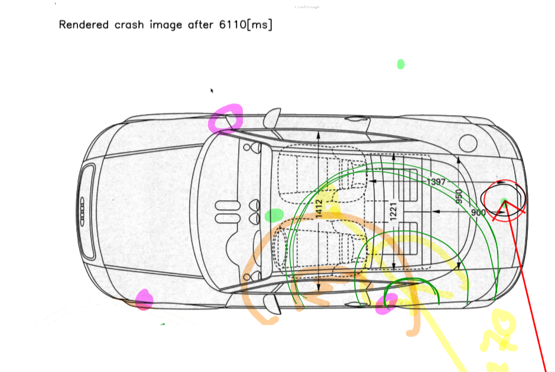

# Damage drawer

## Funktionsumfgang

Mit der Klasse DamageImage (File: `damage_image.py`) werden alle Funktionalitäten im Zusammenhang mit der Bild zusammengebündelt. Die Umfasst als Beispiel das Erkennen der Kulturen von dem Auto, das Zeichnen der Beschädigung wie auch das Beschriften der Milisekunden des Aufpralls, die Crash-ID und weiter Informationen.

## Funktiondesign

### Software Abhängigkeiten 

Für die Erkennung der Kulturen wurde die Bildverarbeitungs Library OpenCV (Open Source Computer Vision Library) verwendet. Die Kulturen werden verwendet um den Eintrittspunkt der Beschädigung zu berechnen.

Für die Berechnung innderhalb der Klasse DamageImage wurde auf die bekannte Python Library Numpy (http://www.numpy.org) zurückgefriffen.

Die Python Standardbibliothek `os` / `math` / `shutil` werden für kleinere Funktionen benötigt. 

### Prozess des Funktiondesigns 

Zu Beginn wurde mittels OpenCV die Datei eingelesen und hardcoded ein Kreis und ein Pfeil gezeichnet. Mit dieser Version haben wir dann im Teamm das Zieldesign der Bilddatei mittels iPad und Pen gezeichnet. 

|Erste Version Damage Image                                                         |
|:---------------------------------------------------------------------------------:|
|  |

|Skizze Damage drawer                                                 |
|:-------------------------------------------------------------------:|
||


## Realisation / Umsetzung

Klassendiagramm und Beschreibung der Funktionen der einzelnen Methoden.

## Klasse DamageImage

Teilfunktion: Damage Image


### Methode: Init

```python
def __init__(self, angle_impact, max_force, damage_id, crash_time, max_force_offset=None):
```

Die Init Methode wird aufgerufen bei der Instanzierung von einem Objekt. Als Parameter werden folgende Informationen benötigt:

| Paramenter               | Beschreibung
|--------------------------|------------------------------------------------------------------------------------------------------------|
| `self`                   | Instanz-Referenz                                                                                           |
| `angle_impact`           | Winkel in Grad. Mit diesem Winkel wird der Aufprall der Beschädigung gezeichnet.                           |
| `max_force`              | Numerischer Wert mit dem die Grösse der Beschädigung am Auto berechnet wird.                               |
| `damage_id`              | String. Eindeutiger Crash-Report ID                                                                        |
| `crash_time`             | String. Uhrzeit für die Beschriftung auf dem Bild                                                          |
| `max_force_offset`       | Numerischer Wert. Zeitpunkt, nach wie vielen Millisekunden die Beschädigung berechnet wurde (Default=None) |

Mit den Methoden Parameter werden die jewiligen lokalen / privaten Methodenvariabeln initialisiert und den Wert zugewiesen. Weiter wir de Pfad wo die Bilddatei gespeichert wird aufgrund der `damage_id` und der allfälligen `max_force_offset`. Die Dateine werden in einem speziell definierten Ort (`images_rendered/`) gespeichert. Dies hat den Grund, dass wenn die Bilddatei von den gleichen Crash-Report und dem gleichen `max_force_offset` nicht nochmals neu erstellen und schreiben muss, sondern direkt zurückgeben kann. 

### Methode: Kulturen Auto 

```python
def __cut_car(self):
```

| Paramenter         | Beschreibung
|--------------------|------------------------------------------------------------------------------------------------------------|
| `self`             | Instanz-Referenz                                                                                           |

Die Methode `__cut_car` findet mittels OpenCV die Kulturen (Randkulturen) von dem Auto-Bild. Diese Kulturen werden als Pixel-Matrix abgespeichert und später für den Eintrittspunkt der Beschädigung benötigt. Dazu wird das Auto-Bild in Schwarz/Weiss konvertiert und den Threshold für die Linien gesetzt. Mittels der OpenCV Funktion `cv2.findContours` können die äussersten, geschlossenne Linien abgefragt werden.


### Methode: Zeichnen

```python
def __draw(self):
```

| Paramenter         | Beschreibung
|--------------------|------------------------------------------------------------------------------------------------------------|
| `self`             | Instanz-Referenz                                                                                           |

Die generelle Zeichnungsmethode `__draw` ist als Wrapper Methode zu verstehen. Wenn gegebenenfalls noch weitere Beschriftungen auf die Bilddatei geschrieben werden soll, kann dies hier eingefügt werden. Hier passiert auch die Entscheidung ob der Text für den Offset der Millisekunten angezeigt wird oder nicht.


### Methode: Zeichnen - Pfeil

```python
def __draw_arrow(self):
```

| Paramenter         | Beschreibung
|--------------------|------------------------------------------------------------------------------------------------------------|
| `self`             | Instanz-Referenz                                                                                           |

Hier wird der Pfeil für die Bilddatei gezeichnet. Etwas unschön ist hier, dass auch noch der Nullpunkt des Koordinatensystem in dieser Methode gezeichnet wird. Eine entsprechendes `# TODO:` ist hier vermerkt.


### Methode: Zeichnen - Kreis

```python
def __draw_circle(self):
```

| Paramenter         | Beschreibung
|--------------------|------------------------------------------------------------------------------------------------------------|
| `self`             | Instanz-Referenz                                                                                           |

Der Kreis für die für die Grösse der Beschädigung wird hier auf die Bilddatei gezeichnet. Die Grösse von dem Kreis (Radius) wird mit Hilfe der Funktion `__dynamic_damage_calc` berechnet.


### Methode: Text auf das Bild 

```python
def __add_text(self, off_set_in_milliseconds):
```

| Paramenter                            | Beschreibung
|---------------------------------------|----------------------------------------------------------------------------------------------|
| `self`                                | Instanz-Referenz                                                                             |
| `off_set_in_milliseconds`             | Numerischer Wert. Zeitpunkt, nach wie vielen Millisekunden die Beschädigung berechnet wurde  |


Auf der resultierende Bilddatei werden folgende Informationen dargestellt:

* Time-Offset von der maximalen Beschädigung
    * Text: `Rendered crash image after " off_set_in_milliseconds + "[ms]"`
* Eindeutige Bilddatei Beschriftung mit der entsprechender Uhrzeit aus dem Crashreport
    * Text: `crash identifier = " + self.damage_id + " - damage time = " crash_time`


### Methode: Berechnung Beschädigung

```python
def __dynamic_damage_calc(self, damage):
```

| Paramenter         | Beschreibung
|--------------------|------------------------------------------------------------------------------|
| `self`             | Instanz-Referenz                                                             |
| `damage`           | Numerischer Wert mit dem die Grösse der Beschädigung am Auto berechnet wird. |

Diese Hilfsmethode berechnet aufgrund einem numerischen Wert die grösse der Beschädigung. Die maximale Beschädigung von `15` und die minimale Beschädigung von `2` wurden aus den Daten ermittelt.

### Methode: Schreiben der Bilddatei

```python
def __write_image(self):
```
| Paramenter         | Beschreibung
|--------------------|------------------------------------------------------------------------------------------------------------|
| `self`             | Instanz-Referenz                                                                                           |

Hier wird die PNG-Bilddatei auf den lokalen Storage von dem Server heruntergeschrieben.

### Methode: Pfad der geschriebene Datei

```python
def get_image(self):
```

| Paramenter         | Beschreibung
|--------------------|------------------------------------------------------------------------------------------------------------|
| `self`             | Instanz-Referenz                                                                                           |

Diese Public Methode wird von Server verwendet umd die fertige Bilddatei zu erhlaten. Innerhalb dieser Methode werden die Zeichnungsmethoden `self.__draw()` und die `self.__write_image()` ausgeführt.

Als Rückgabewert erhält der Server den Pfad der Datei, welche auf dem Server geschrieben wurde.


### Methode: Löschen von allen gerendert Dateien

```python
def remove_all_rendered_image(self):
```

| Paramenter         | Beschreibung
|--------------------|------------------------------------------------------------------------------------------------------------|
| `self`             | Instanz-Referenz                                                                                           |

Diese Housekeeping Methode dient dazu, alle gerenderten Bilddateien auf dem Server zu löschen. Die Methode kann vor dem Start des Server wie auch nach dem Testing ausgeführt werden.

### Methode: Anzeige der Datei auf dem Bildschirm

```python
def show_image(self):
```

| Paramenter         | Beschreibung
|--------------------|------------------------------------------------------------------------------------------------------------|
| `self`             | Instanz-Referenz                                                                                           |

Die `show_image` dient für eine rasche Entwicklung ohne Server. Sie führt die gleichen Methoden aus, wie die Methode `get_image` mit dem Unterschied, dass die Bilddatei nicht an den Server zurückgegeben wird sondern mittels OpenCV an dem Display angezeigt wird. So kann Abhängigkeit vom Server neue Funktionen rasche getestet werden.  


## Implementierung im Projekt

Innerhalb von dem Projekt werden wir die Funktion `get_image` wie folgt benutzt:


Innerhalb vom `server.py` wird ein Damage drawer Objekt erstellt und mittels der Funktion `get_image` die fertig gerenderte Bilddatei zurückgegeben und auf der Webseite dargestellt.

## Mögliche Darstellung der Datei in einem Protal

Ein möglicher Einsatzbereich von unserem Projekt könnte ein Portal von einer Versicherung sein. Hier würde bei Autounfällen der Ort von dem Schaden wie auch das Ausmass der Beschädigung aufgezeigt werden. So kann ein Mehrwert in Form von mehr Informationen an dem Kunde einer Autoversicherung entstehen.


