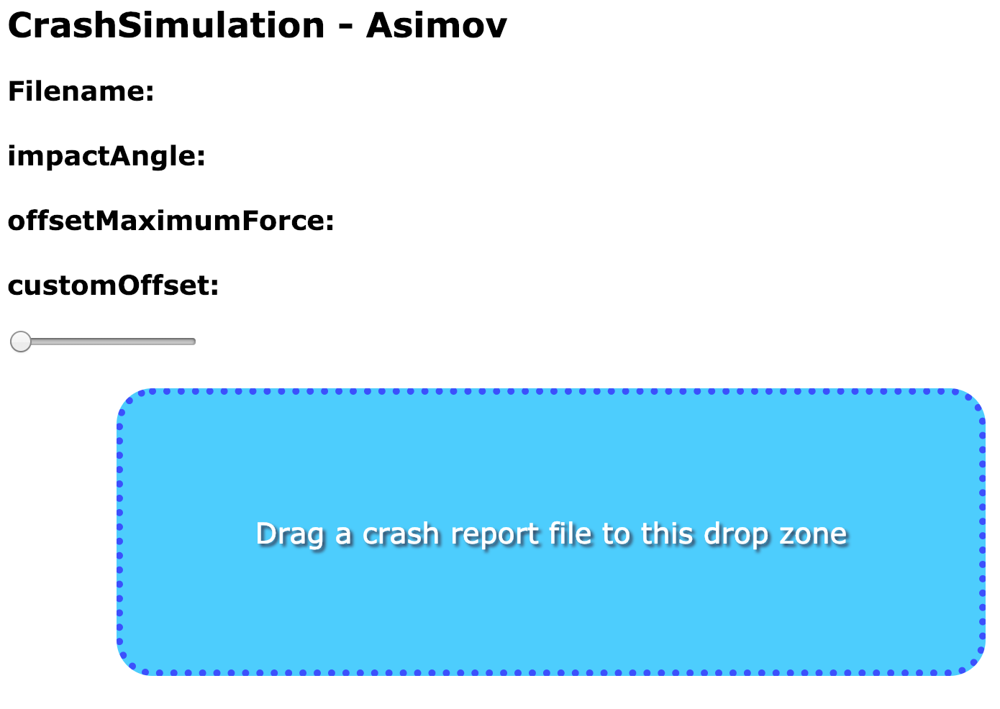
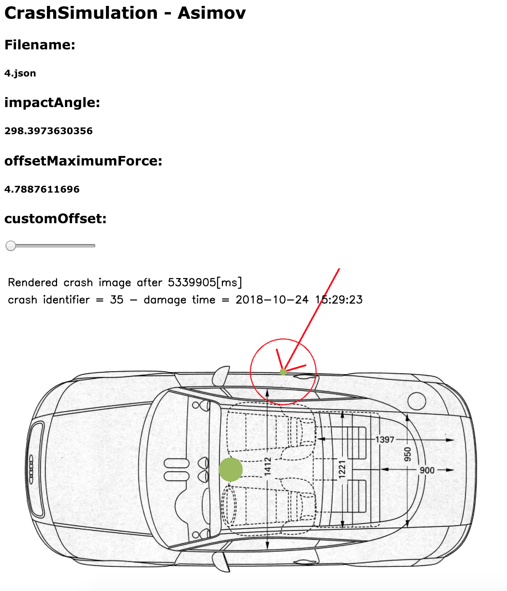

# REST API und Frontend
Für die Challenge ist eine REST API notwendig. Diese ist genau spezifiziert und beinhaltet zwei vorgeschriebene
Funktionen. Wir haben im Verlauf des Projekts noch ein UI gemacht, um die Requests einfacher testen zu können und
dem User eine einfache Verwendung zu bieten. Da in der Challenge erwähnt wird, dass das Hosting
auch berücksichtig werden sollte, verwenden wir Docker; die Applikation kann dadurch
überall laufen gelassen werden, wo Docker installiert ist. Heutzutage ist das eine gängige Art und Weise
etwas auf einem Server laufen zu lassen und bietet dazu auch die Möglichkeit, die Applikation zu skalieren


## REST API Requests


### Crash Info
Die 'Crash Info' API Funktion ist dazu da, den 'impactAngle' (Winkel des Einschlags beim Crash) und den
'offsetMaximumForce' (die Maximalkraft, die eingewirkt hat) zurückzugeben.
Die Daten werden als JSON verpackt und zurückgegeben.

Der Python Code dazu sieht folgendermaßen aus:

```Python
# POST request 1 - returns JSON:
# {"impactAngle": degrees, "offsetMaximumForce": millisecond}
@app.route('/api/v1/getCrashInfo', methods=['POST',])
async def crash_info(request):
    ''' crash info parses the crash record and returns a JSON object '''
    log.info("Handling '/api/v1/getCrashInfo'")

    angle, max_force_offset, _, _, _ =
    DataParser().parse_input_data(request.body.decode('utf8'))

    return json({'impactAngle': angle,
                 'offsetMaximumForce': max_force_offset})
```

Crash_info ist eine Asynchrone Methode welche als 'POST' Request markiert ist und die 'api/v1/getCrashInfo' Route nutzt. Die
Annotationen werden von dem 'sanic' Framework bereitgestellt.
Ein Log Eintrag hilft beim Debuggen. Die Hauptarbeit wird aber in dem 'DatenParser' gemacht welche alle relevanten
Daten zurückgibt. Die Daten (autoSense JSON) für den 'DataParser' werden im Request übergeben. Die letzte Zeile baut ein JSON
Objekt und gibt die Antwort auf den Request an den Sender zurück.


### Crash Image
Die Crash Image Methode gibt ein Bild zurück, welches den Einschlag und die maximale Krafteinwirkung des Unfalls illustriert.

Der Python Code dazu sieht folgendermassen aus:

```python
# POST request 2 - returns a rendered crash image (PNG)
@app.route('/api/v1/getCrashImage', methods=['POST',])
async def crash_image(request):
    ''' crash image parses the crash record and returns a Image '''
    log.info("Handling '/api/v1/getCrashImage'")

    customOffset = 0
    try:
        customOffset = int(request.args.get('timeOffsetMS'))
    except Exception as e:
        log.error(e)

    log.info("Set customOffset: " + str(customOffset) + "ms")

    angle_impact, max_force, damage_id, crash_time, max_force_offset =
    DataParser().parse_input_data(
                        request.body.decode('utf8'),
                        custom_offset=customOffset)

    d = DamageImage(angle_impact, max_force, damage_id,
                    crash_time, max_force_offset)
    return await file(d.get_image())
```

Die Route des Requests ist '/api/v1/getCrashImage'. Ein Offset zum Zeitpunkt des Aufpralls kann übergebene werden
('timeOffsetMS'). Zusätzlich muss wieder das JSON vom autoSense Sensor übergeben werden.
Der 'DataParser' übernimmt wieder die Hauptaufgabe dieses Requests.
Zusätzlich wird die 'DamageImage' Klasse zum generieren des Bildes verwendet. Anschliessend wird das generierte Bild
zurückgegeben.


### Play
Zusätzlich zur gegebenen Aufgabenstellung haben wir noch eine Funktion eingebaut, welche mehrere Bilder zurückgibt, um
den Unfall genauer zu inspizieren.
Es wird grundsätzlich dasselbe gemacht wie beim 'Crash Image' Request, es wird aber eine Liste von Bildern zurückgegeben, welche
dann im Browser dargestellt werden können. Diese Methode ist nicht optimal, da alle Bilder zuerst berechnet werden
müssen und nicht gestreamt werden kann.


## Frontend
Das Frontend ist sehr simpel aufgebaut:

|Frontend Design                                                                    |
|:---------------------------------------------------------------------------------:|
|{ width=400px }              |


Das UI bietet eine Drag & Drop Zone um ein JSON File von autoSense hochzuladen. Sobald man ein valides JSON
hochgeladen hat werden im Hintergrund die beiden API Requests an das Backend gesendet. Anschliessend werden das Bild und die Daten (Filename, impactAngle & offsetMaximumForce) angezeigt. Optional kann noch der 'customOffset'
eingestellt werden, um statt der Maximal-Kraft die Kraft zu einem anderen Zeitpunkt des Aufpralls darzustellen.

Frontend mit hochgeladenem JSON:

| Frontend mit geladenem JSON                                                                             |
|:-------------------------------------------------------------------------------------------------------:|
|{ width=400px }     |

## Docker
Docker ist ein Tool um Images zu kreieren, welche dann in einem sogenannten Container ausgeführt werden können. Dadurch kann eine
Applikation unabhängig vom Betriebssystem ausgeführt werden.
Ausserdem ist es möglich, eine Applikation zu skalieren indem mehrere Container auf verschiedenen Systemen ausgeführt
werden und ein Proxy dazwischen geschaltet wird.  

Unser Basis Image ist ein Python3.7 Image von DockerHub (einer öffentlichen Registry bei der Images hochgeladen werden).
Wir installieren zuerst alle Abhängigkeiten, damit die zusätzlichen Python Libraries (wie zum Beispiel numpy) installiert
werden können.
Anschliessend werden die Python Abhängigkeiten installiert, bevor schlussendlich alle Files der Applikation in das Image
kopiert werden. Zum Schluss wird die Working Directory und der Entrypoint (der Webserver) spezifiziert.
